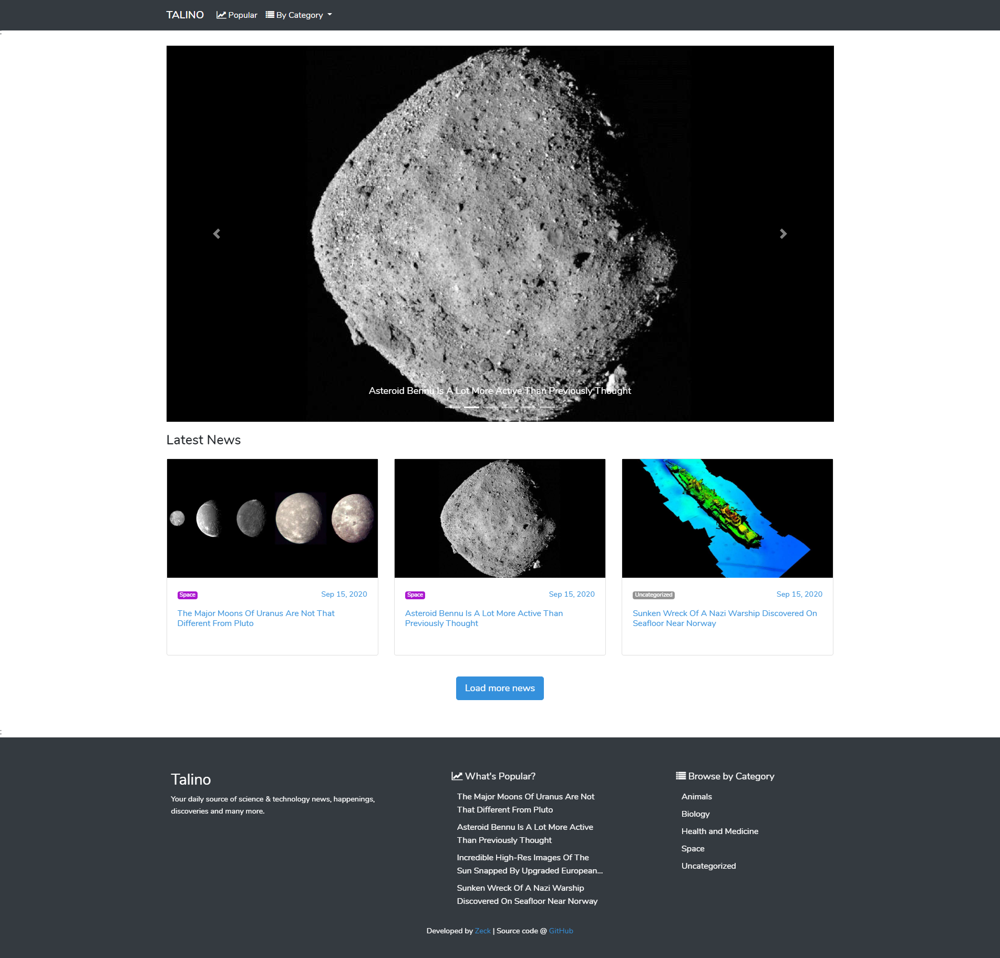
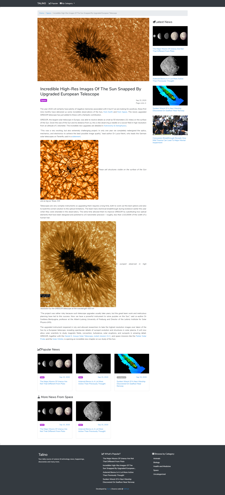
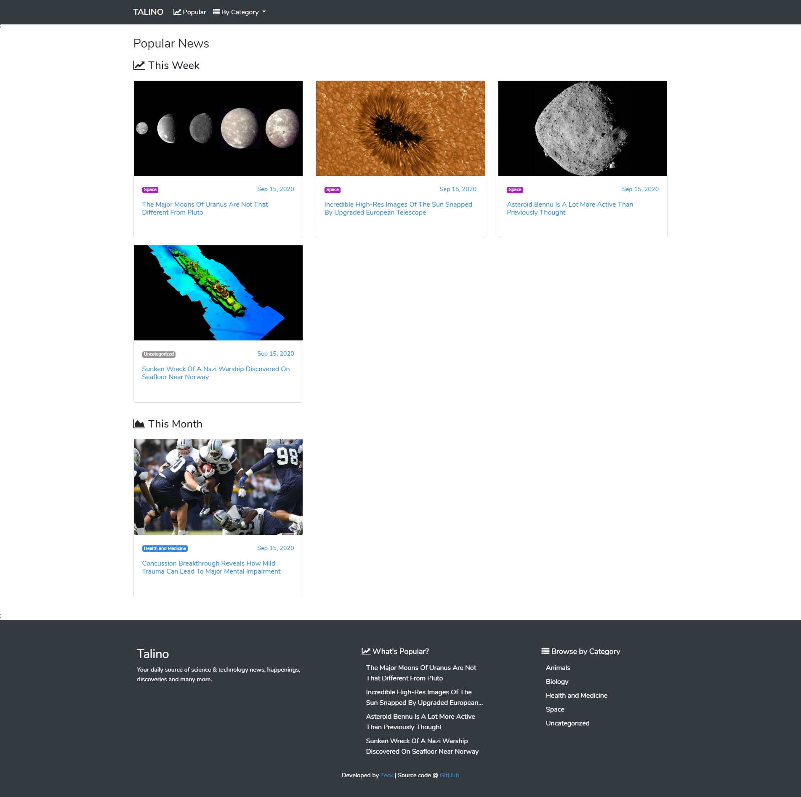
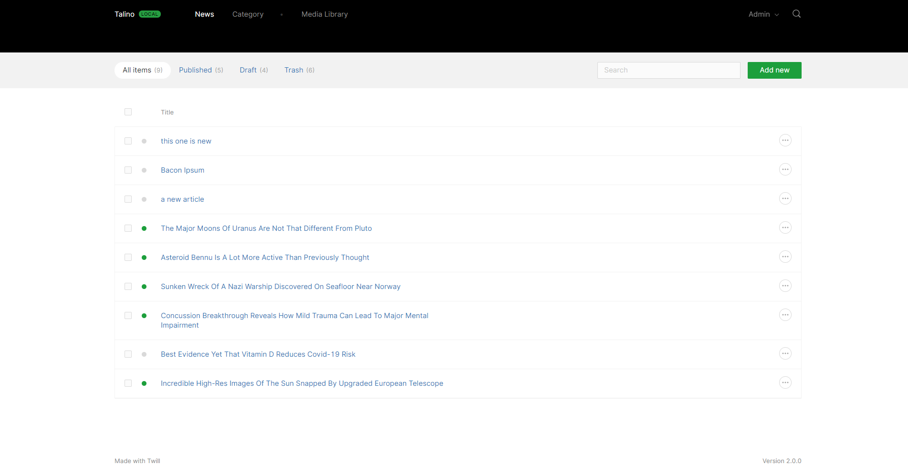
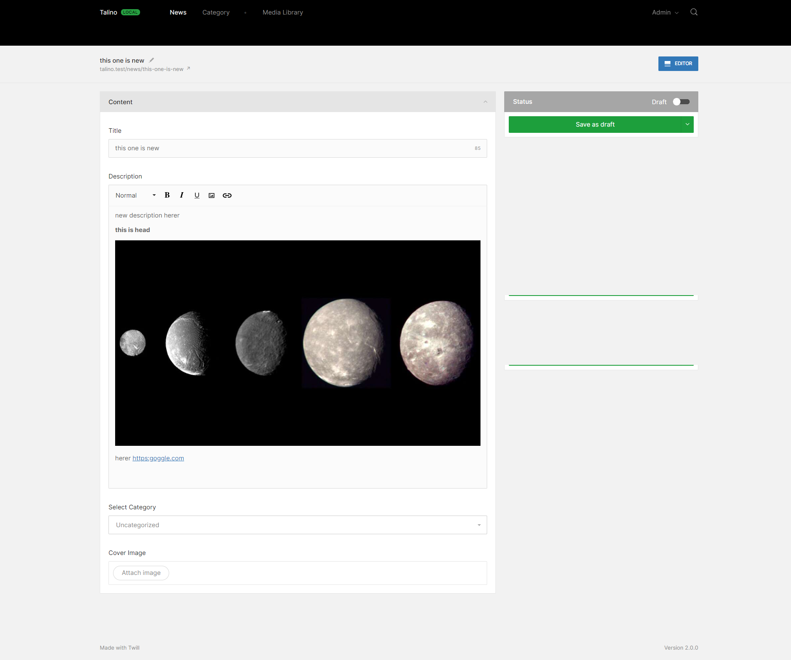
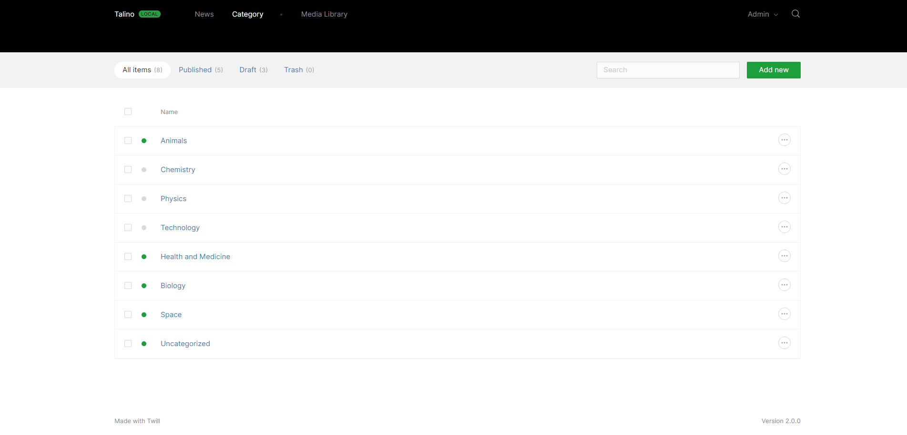
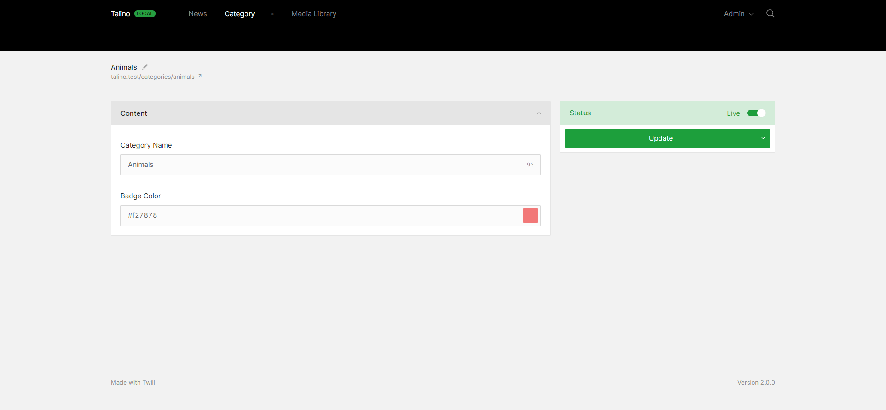

# Talino

A blog app built using Laravel + Twill CMS

## Screenshot

**Disclaimer**  
I did not write the article used in the screenshot. I got them from [IFL Science](https://www.iflscience.com/)

 

### Client Side 

 Home Page 

 Single/Blog Page 

 Category Page 

 Popular Page 

 

### Admin Side
 News List Page 

 News Form Page 

 Category List Page 

 Category Form Page 

